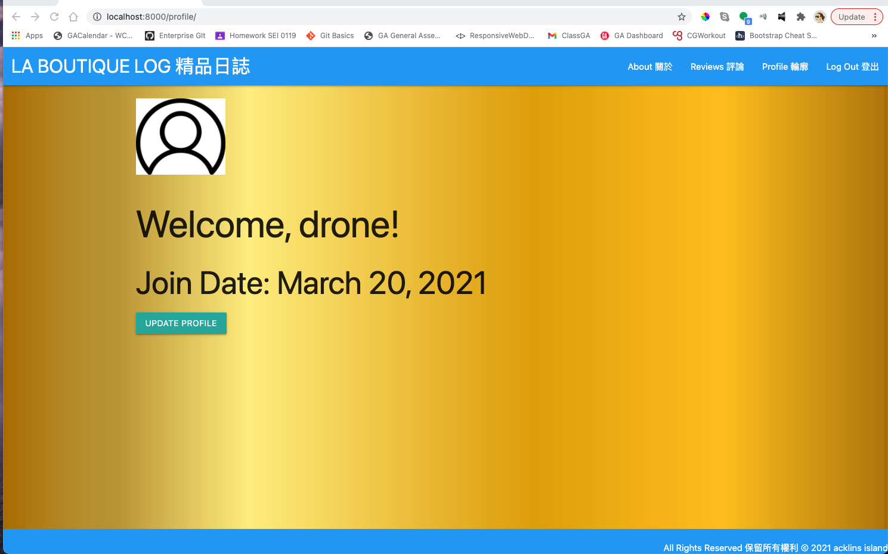
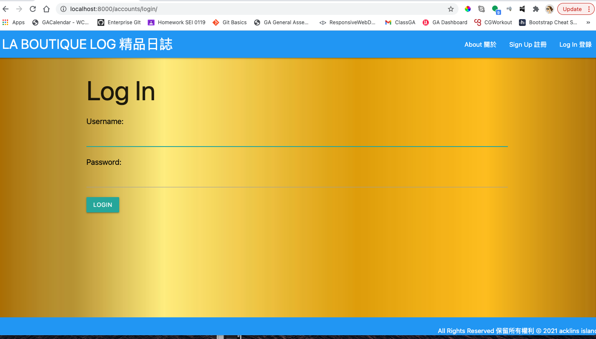
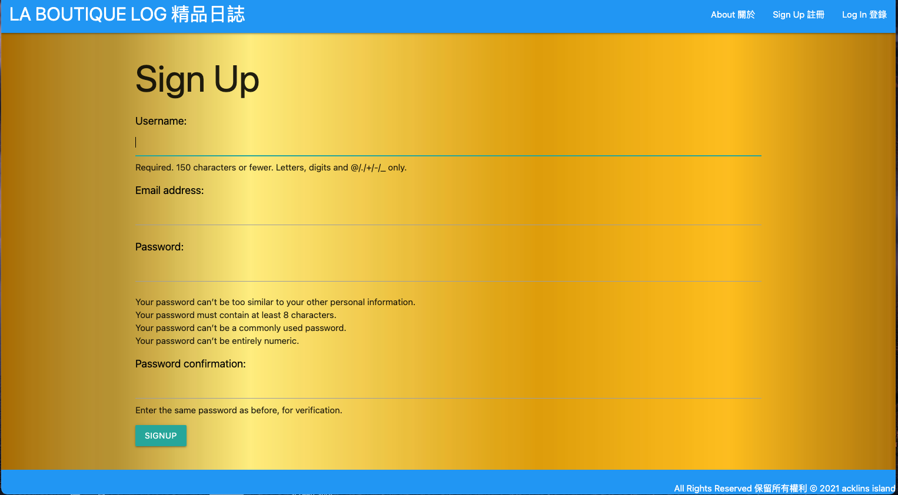
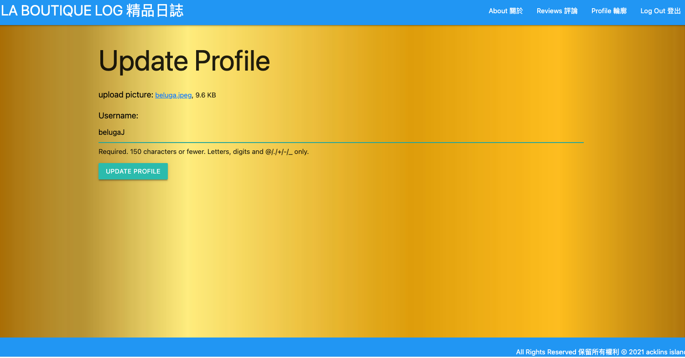
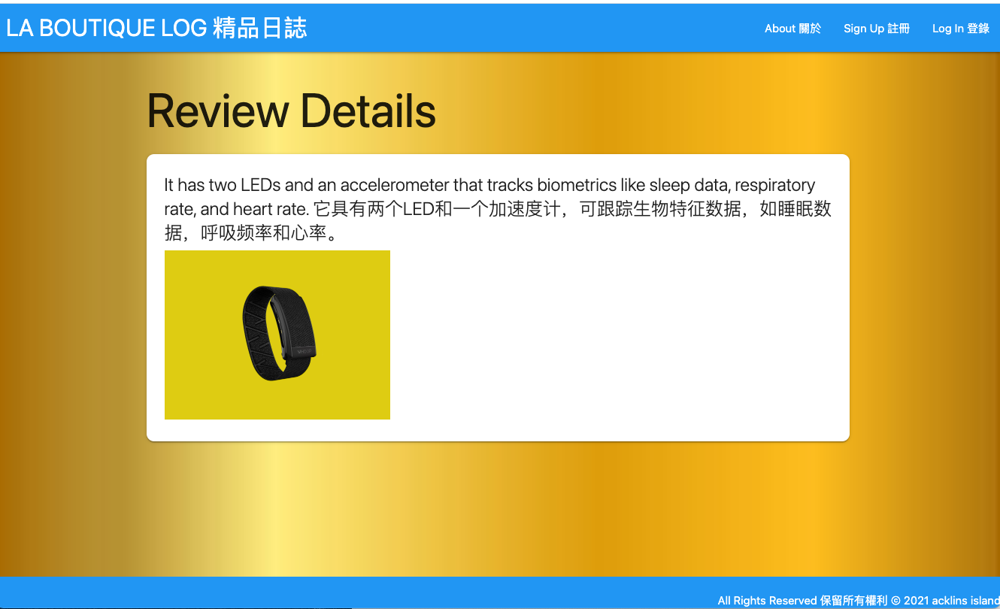
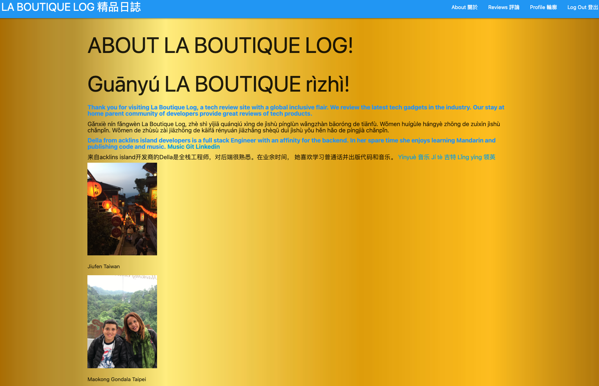
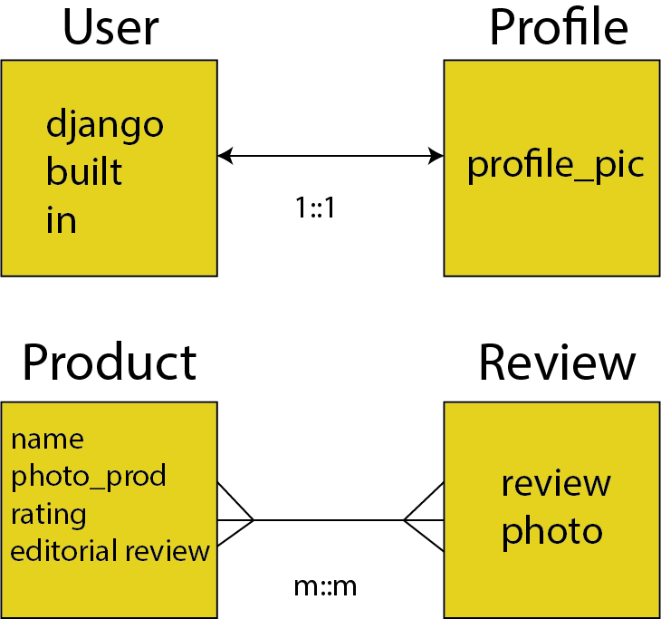
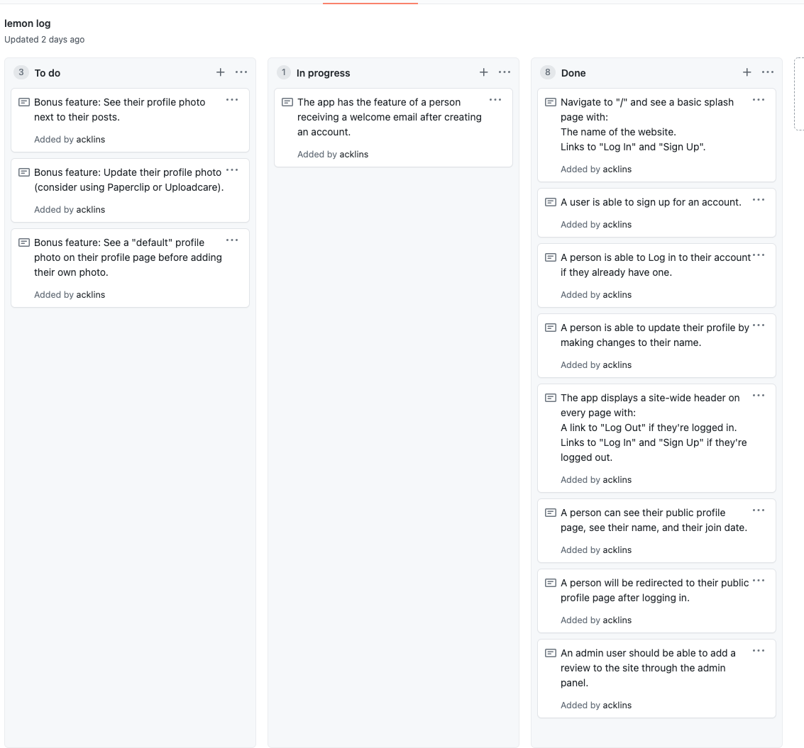

# LA BOUTIQUE LOG

# Project Description:
This app is a tech review site, named La Boutique Log, 
it builds out basic auth for users and an admin. 
Where a user can see reviews, update their 
name and add a profile picture. The site admin 
can add and post product reviews.

# App screenshots:

# ERD diagram:

# Kanban-style scrum board selection:

# List of Technologies and Industry concepts/practices used:
python
django
Materialize
google translate
Adobe illustrator
i18n(internationalization) 
QA Test Guidance doc

# Installation instructions:
Fork and clone this repo
Run python3 -m venv .env
Run source .env/bin/activate
Run pip3 install django
Run pip3 install psycopg2
Run pip3 freeze > requirements.txt
Run  pip3 install -r requirements.txt
Run python3 manage.py runserver
Run createdb techlux
In settings.py file change to: DATABASES = {
    'default': 
        'ENGINE': 'django.db.backends.postgresql',
        'NAME': 'labou',
Run python3 manage.py migrate    
Open browser to Localhost:8000

# User Stories:
As a user I want to be able to navigate to "/" and see a basic splash page with:
The name of the website.
Links to "Log In" and "Sign Up" and
Sign up for an account.

As a user I want to be able to log into my account if I have one.
Be redirected to the public profile page after logging in.
On my public profile page, see my name, and the join date.
See the site-wide header on every page with:
A link to "Log Out" if I am logged in.
Links to "Log In" and "Sign Up" if I am logged out.
Update my profile by making changes to my name.

As an admin user I want to be able to add a review to the site through the admin panel.

# Unsolved Problems/major hurdles:

-Extending django's built in user model and all it offers to keep the code DRY.
Learning how to use it prevented building out a full profile model & kept the model file DRY.

-Enabling an email feature that accepts all emails, settled on gmail in the end.
- Using UploadCare for the profile and product images. The 3rd party storage is a great resource for keeping memory DRY.
